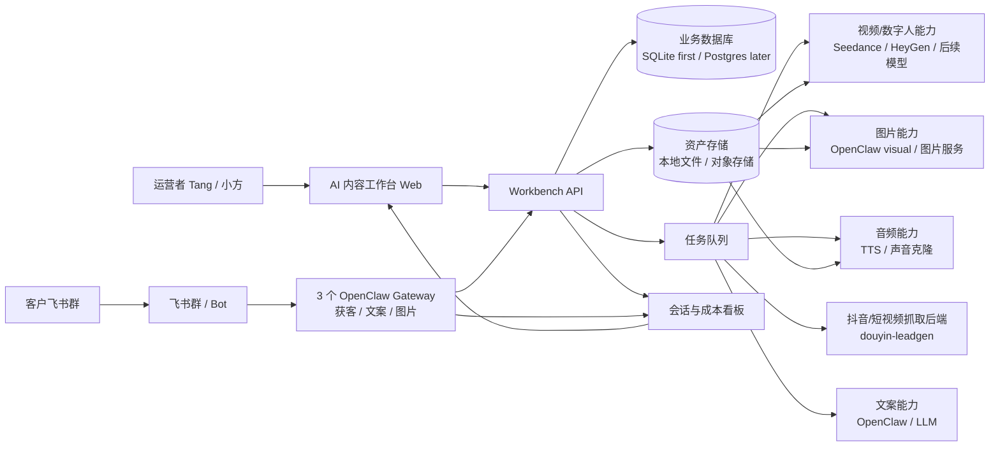
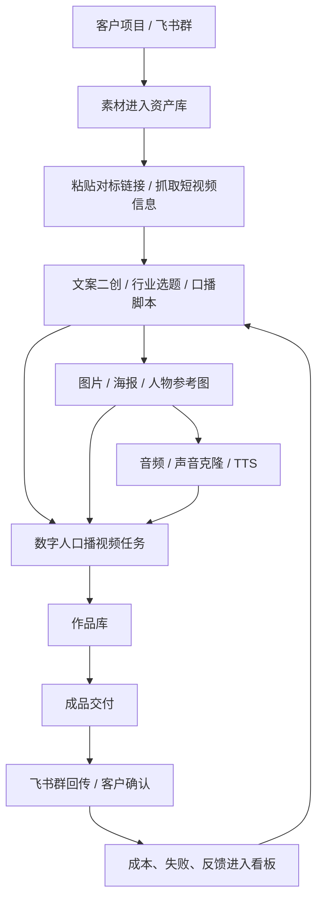
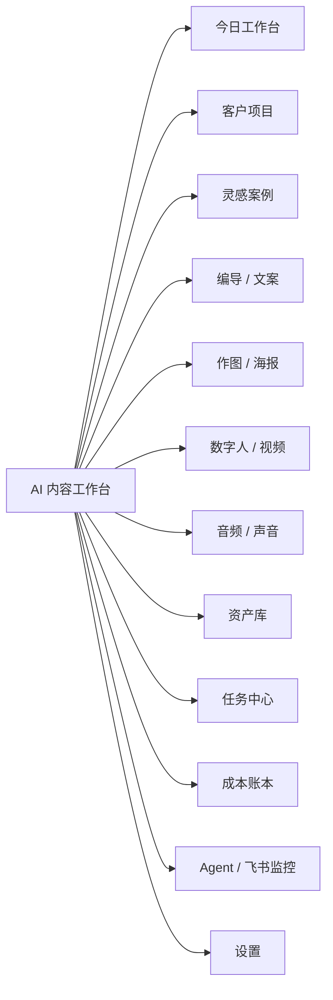
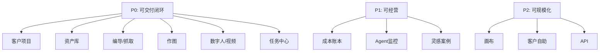

# AI 内容工作台：网站架构与前端页面设计

> 日期：2026-06-25  
> 背景：对标 Timarsky 星空，但产品目标不是复制工具集合，而是把现有文案、图片、爬取、视频/数字人 bot 网页化，形成美业获客和内容交付闭环。  
> 相关文档：[`竞品拆解-Timarsky星空-20260625.md`](./竞品拆解-Timarsky星空-20260625.md)、[`战报-OpenClaw获客矩阵.md`](./战报-OpenClaw获客矩阵.md)。

## 1. 产品定位

一句话：这是一个面向美业获客交付的 **AI 内容工作台**。

它不是普通 AI 工具站，也不是只给程序员看的后台。它要把三件事合在一起：

1. **客户项目管理**：一个客户群、一个项目、一个成交单元。
2. **内容生产流水线**：抓取对标视频 → 生成文案 → 生成图片/海报 → 生成数字人口播 → 交付。
3. **运营可控性**：任务状态、失败原因、成本账本、飞书 bot 状态、客户消耗都能看到。

## 2. 总体系统架构



### 设计原则

- **Web 是中控台**：创建任务、查看结果、管理素材、看成本。
- **飞书是客户现场**：客户仍然可以在群里 @ bot 使用能力。
- **后端任务化**：不要让网页直接长时间等待模型，所有重任务都进入任务队列。
- **能力服务隔离**：爬取、文案、图片、音频、视频可以先在一台服务器上，代码和任务边界先拆清楚。

## 3. 业务闭环



这条链路是第一版必须跑通的主线。画布、多模型商城、AI 工具大全都可以后做。

## 4. 前端信息架构



### 第一版左侧导航

| 导航 | 作用 | 对标竞品 |
|---|---|---|
| 今日 | 今日行动、失败、成本、客户动态 | 竞品没有，属于我们优势 |
| 客户 | 项目、人设、门店、飞书群绑定 | 品牌立项 |
| 灵感 | 模板和案例，「做同款」 | 灵感 |
| 编导 | 抓取、拆解、文案、分镜 | 编导 |
| 作图 | 参考图、海报、电商图、人物图 | 作图 |
| 视频 | 数字人口播、视频任务 | 视频 |
| 音频 | 声音克隆、TTS、音频提取 | 音频 |
| 资产 | 素材、作品、交付 | 资产 |
| 任务 | 所有异步任务和失败重试 | 竞品历史记录 |
| 成本 | 积分、人民币、模型消耗 | 点数 |
| Agent | 飞书 bot 和 OpenClaw 状态 | 我们独有 |

## 5. 页面设计

### 5.1 全局布局

```text
┌──────────────────────────────────────────────────────────────┐
│ 顶部上下文栏：当前客户 / 飞书群 / 今日成本 / 余额 / 操作人       │
├──────────────┬───────────────────────────────┬───────────────┤
│ 左侧导航      │ 主工作区                         │ 右侧检查器     │
│ 240px        │ 表单 / 列表 / 结果 / 看板          │ 320px         │
│              │                               │ 项目上下文     │
│ 今日          │                               │ 预计成本       │
│ 客户          │                               │ 最近失败       │
│ 编导          │                               │ 飞书绑定       │
│ 作图          │                               │               │
│ 视频          │                               │               │
└──────────────┴───────────────────────────────┴───────────────┘
```

移动端不优先。生成视频、整理素材、复盘成本天然适合桌面端。

### 5.2 今日工作台

目标：打开网页后立刻知道今天该干什么。

首屏模块：

- 今日行动
  - 待处理失败任务
  - 成本异常客户
  - 需要回传飞书的作品
  - 等待客户确认的交付
- 关键指标
  - 今日客户群消息数
  - 今日任务数
  - 今日成本
  - 失败率
  - 平均响应时间
- 三条生产线状态
  - 抓取/文案
  - 图片/海报
  - 数字人/视频
- 最近失败
  - 失败时间
  - 客户
  - 能力
  - 原因
  - 重试按钮

### 5.3 客户项目页

目标：把“一个飞书群 = 一个客户 = 一个成交单元”产品化。

字段：

- 客户名称
- 行业/细分赛道
- 飞书群
- 绑定 bot：获客、文案、图片、数字人
- 项目状态：试用、交付中、长期服务、暂停
- 预算/套餐
- 人设/门店/产品资料
- 关联资产
- 成本和任务历史

页面结构：

```text
客户列表 → 客户详情

客户详情：
- 概览
- 项目资料
- 飞书群
- 资产
- 任务
- 成本
- 交付记录
```

### 5.4 灵感案例页

目标：让客户和运营者从模板开始，而不是面对空白输入框。

分类建议：

- 美业获客
- 美容院招商
- 门店引流
- 老板 IP
- 数字人口播
- 活动海报
- 产品种草
- 对标拆解

卡片内容：

- 封面
- 标题
- 适用行业
- 使用能力：抓取/文案/图片/视频
- 预计成本
- 做同款

### 5.5 编导 / 文案页

对应现有文案 bot 和抖音抓取能力。

子标签：

- 对标链接拆解
- 文案二创
- 行业选题
- 口播脚本
- 分镜脚本
- 文案库

核心流程：

```text
粘贴链接 → 抓取标题/字幕/评论/指标 → 提取卖点 → 二创文案 → 保存到文案库 → 进入图片/视频
```

表单设计：

- 输入：抖音/小红书/视频号链接
- 选择：客户项目、人设、文案类型、语气
- 输出：标题、钩子、正文、分镜、评论区引导
- 操作：复制、保存、生成图片、生成视频、发飞书

### 5.6 作图 / 海报页

对应现有图片 bot 和 Seedance 素材。

子标签：

- 图片创作
- 招商海报
- 产品图
- 人物参考图
- 局部修图
- 历史记录

核心控件：

- 参考图上传/选择
- 文案提示词
- 比例：9:16、1:1、4:5、16:9
- 张数
- 风格/用途
- 预计成本

结果卡操作：

- 继续改图
- 生成视频
- 保存到资产库
- 下载
- 发飞书

### 5.7 数字人 / 视频页

这是本月主线，必须设计成任务流，不要做成聊天框。

子标签：

- 图片驱动口播
- 视频驱动口型
- 脚本成片
- 视频包装
- 历史任务

核心流程：

```text
选择人物图 / 上传视频
→ 选择声音 / 上传音频
→ 填写口播文案
→ 设置比例、时长、动作提示
→ 预计成本
→ 提交任务
→ 任务中心排队
→ 作品库预览
→ 成品交付
```

页面必须显示：

- 素材完整度：人物图、音频、文案是否齐
- 预计时长
- 预计成本
- 生成状态
- 失败原因
- 是否已回传飞书

### 5.8 音频 / 声音页

对应本地 Seedance 音频素材和未来声音克隆。

子标签：

- 声音库
- 声音克隆
- 文本转语音
- 视频提取音频
- 背景音分离

字段：

- 声音名称
- 所属客户/人物
- 源音频
- 情绪版本
- 可用状态
- 授权备注

### 5.9 资产库

资产库是网页化 bot 的核心，不是附属页面。

资产类型：

- 图片素材
- 视频素材
- 音频素材
- 文案
- 生成作品
- 成品交付

资产字段：

- 类型
- 所属客户
- 来源：上传、抓取、生成、飞书
- 关联任务
- 可否交付
- 是否敏感
- 成本
- 创建时间

本地目录映射：

| 本地目录 | 网页资产分类 |
|---|---|
| `01-输入素材/图片参考` | 图片素材 |
| `01-输入素材/视频素材` | 视频素材 |
| `01-输入素材/音频素材` | 音频素材 |
| `00-项目说明与文案` | 文案库 |
| `02-生成产出` | 作品 |
| `03-成品交付` | 交付 |
| `04-平台工作区` | 第三方平台记录 |

### 5.10 任务中心

所有重任务都进入任务中心。

任务状态：

- Draft
- Queued
- Running
- Succeeded
- Failed
- Cancelled
- Delivered

任务列表列：

- 任务
- 客户
- 能力
- 输入
- 状态
- 预计/实际成本
- 耗时
- 失败原因
- 操作

操作：

- 查看输入
- 查看输出
- 重试
- 复制错误
- 发飞书
- 标记已交付

### 5.11 成本账本

目标：不要让 AI 成本悄悄吞掉毛利。

视图：

- 今日成本
- 本周成本
- 按客户成本
- 按能力成本
- 按模型成本
- 失败浪费成本
- 高成本客户 Top N

所有生成按钮都要展示预计消耗：

```text
立即生成
预计：32 秒 · 160 点 · 约 ¥X
```

### 5.12 Agent / 飞书监控

对应我们现有 AI 会话看板。

模块：

- Agent 花名册
- 飞书群绑定
- 回复率
- 最近消息
- 最近失败
- 可用能力
- 权限状态
- 版本/配置

这里是我们区别于竞品的关键：竞品只管生成，我们能管“AI 员工在客户群里有没有正常上班”。

## 6. 数据模型草案

| 表/实体 | 说明 |
|---|---|
| `customers` | 客户/成交单元 |
| `projects` | 客户项目，可一客户多项目 |
| `feishu_chats` | 飞书群 |
| `agents` | OpenClaw agent / bot 配置 |
| `assets` | 图片、视频、音频、文案、成品 |
| `tasks` | 所有异步任务 |
| `task_events` | 任务状态流水 |
| `works` | 可预览作品 |
| `deliveries` | 已交付记录 |
| `cost_events` | token、图片、视频、音频成本 |
| `templates` | 灵感案例/做同款模板 |
| `prompts` | 可复用提示词/文案结构 |

## 7. API 草案

| API | 用途 |
|---|---|
| `GET /api/dashboard` | 今日工作台 |
| `GET /api/customers` | 客户列表 |
| `POST /api/customers` | 新建客户项目 |
| `GET /api/assets` | 资产列表 |
| `POST /api/assets/upload` | 上传素材 |
| `POST /api/tasks/crawl` | 创建抓取任务 |
| `POST /api/tasks/copy` | 创建文案任务 |
| `POST /api/tasks/image` | 创建图片任务 |
| `POST /api/tasks/audio` | 创建音频任务 |
| `POST /api/tasks/video` | 创建数字人/视频任务 |
| `GET /api/tasks` | 任务列表 |
| `GET /api/tasks/:id` | 任务详情 |
| `POST /api/tasks/:id/retry` | 重试任务 |
| `POST /api/deliveries/feishu` | 回传飞书 |
| `GET /api/costs` | 成本账本 |
| `GET /api/agents` | Agent 状态 |

## 8. 第一版技术选型

第一版不要过度工程化。

推荐：

- Frontend：Next.js 或 Vite + React。
- UI：自建轻量组件 + lucide icons。
- Backend：FastAPI 继续复用当前习惯。
- DB：SQLite 起步，后续客户多了迁 Postgres。
- Queue：先用 SQLite task table + worker polling，后续换 Redis/RQ/Celery。
- Assets：本地文件系统起步，后续迁对象存储。
- Auth：第一版 Basic Auth / 管理员账号；客户开放前再做多角色权限。

## 9. 第一版范围

P0 只做这 6 个页面：

1. 今日工作台
2. 客户项目
3. 编导/抓取
4. 作图
5. 数字人/视频任务
6. 资产库 + 任务中心

P1 再做：

- 成本账本完整化
- 飞书 Agent 监控内嵌
- 灵感案例/做同款
- 音频库

P2 再做：

- 画布
- AI 工具大全
- API 开放
- 客户自助登录

## 10. 页面优先级



## 11. 关键产品判断

- 不要复制竞品的「工具大全」作为第一版核心。
- 我们第一版必须围绕美业获客和数字人交付。
- 网页要承接飞书 bot，而不是替代飞书。
- 每个任务必须有状态、成本、失败原因。
- 资产库要从第一天就存在，否则 AI 第二次做同样任务还是不会复用旧素材。

## 12. 最小可用原型

第一轮开发目标：

```text
选择客户
→ 上传/选择素材
→ 粘贴对标链接
→ 生成文案
→ 生成图片
→ 提交数字人口播任务
→ 查看任务状态
→ 保存作品
→ 回传飞书
→ 成本入账
```

这条链路比 20 个孤立工具更值钱。
