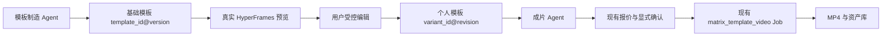

# HyperFrames 模板制造与成片 Agent 开发计划

> 日期：2026-09-11
>
> 状态：可执行计划，尚未实施
>
> 目标：验证并落地“一个 Agent 负责制造可编辑模板，另一个 Agent 负责调用模板批量生产视频；用户可修改、保存并再次复用个人模板”的完整闭环。

## 1. 结论

可以实现，而且黄雀已经具备大部分生产底座，不需要重建渲染、计费、任务或素材系统。

真正需要新增的是四个窄能力：

1. 给 HyperFrames 模板声明稳定的可编辑字段与版本。
2. 用受控编辑器保存“用户修改差异”，不覆盖基础模板。
3. 让报价和 Job 冻结模板版本、个人模板版本及变量快照。
4. 让 Creator Agent 和 `hq` 能列出、选择、保存和复用个人模板。

第一轮只做一个本地 PoC，不改生产、不调用付费生成。PoC 通过后，再按本文的跨仓顺序接入生产。

## 2. 成功标准

本项目最终成功，不以“代码存在”或“编辑器能打开”为准，而以一条可重复的用户链为准：

```text
模板制造 Agent 创建模板
→ 模板通过检查并发布为不可变版本
→ 用户用真实预览修改受控字段
→ 保存为个人模板版本
→ 退出后重新打开仍完全一致
→ 成片 Agent 用该个人模板和新文案/新素材报价
→ 用户明确确认一次
→ 创建唯一 Job
→ 返回可播放 MP4
→ 再批量生成 3 条且没有重复提交、串素材或覆盖模板
```

验收必须同时具备：

- 基础模板源码哈希未被用户编辑改变。
- 个人模板保存的是小型差异对象，不是整份任意 HTML/JavaScript。
- 预览与最终 MP4 的关键帧、文字、素材顺序和裁剪一致。
- 报价后修改模板或个人版本，旧报价必须失效，不能按新内容使用旧报价。
- 网络结果不确定时只恢复原 Job，不重新创建付费任务。
- 每条成片都有模板版本、个人版本、素材哈希、HyperFrames 版本和最终资产记录。

## 3. 本轮代码调查基线

### 3.1 黄雀主站

调查基线：`huangque-main-site main@c4c9326b`。

已经存在：

- `server/content_domains/matrix_template_video.py`
  - 从生成服务器读取模板目录。
  - 校验标题、CTA、模板、配音、BGM、时长和用户素材。
  - 将本人上传素材转换为 SHA-256 后推送到模板服务器。
  - 已有 preflight、任务提交、轮询、下载、资产回写和运行阶段记录。
- `server/content_domains/matrix_template_submission.py`
  - 已有提交占位、幂等恢复和结果未知保护。
- `server/hq_cli_api.py`、`server/auth_server.py`
  - 已有 `matrix-template-capability`、`matrix-template-templates`、单条和批量生成动作。
  - 已有报价、显式确认、Quote Token 和稳定子任务幂等键。
- `server/creator_agent/`
  - 已有模板计划、修改方案、报价、确认、Job 恢复和批次 revision。
- `site/workbench/matrix-template.html`
  - 已有模板选择、配音、BGM、批量提交、刷新恢复和结果播放器。

当前缺口：

- 主站模板目录没有公开稳定 `template_version`、源码哈希或可编辑字段 Schema。
- 页面“实时预览”是手写 CSS 示意，不是真实 HyperFrames composition。
- Creator Agent 记住的是文字偏好，不是精确个人模板版本。
- `hq` 公开批量动作仍在 Auth 层拒绝 HyperFrames 模板，尽管网页直连链与生成服务器已经支持最多 5 条。
- 生成输入只有 `template_id`，报价没有绑定基础模板版本与个人模板 revision。

### 3.2 模板生成服务器

调查基线：`kong74007-ui/ubuntu-fang-server main@13b460d30338590624e35ae5c5eb13c0c42f73df`。

生产代码位于：

- `server/matrix_template_api.py`
- `deploy/matrix-template-video/install.sh`
- `deploy/matrix-template-video/README.md`

现有能力：

- 当前发布目录为 22 套模板。
- 17 套参考排版模板使用 HyperFrames `0.8.16`。
- 九宫格及部分固定模板使用 `0.8.33`。
- 新固定模板使用 `0.8.34`。
- HyperFrames 共享 2 个渲染槽；服务可接收最多 5 条批量 Job。
- Job 数据库存储完整冻结 payload；固定模板已冻结模板版本、源码哈希、字体哈希、BGM 哈希和运行时版本。
- 固定模板最终通过 `hyperframes render --strict-variables --variables-file` 渲染。
- 已有用户素材 MIME、大小、SHA-256、视频时长和裁剪入点校验。
- 已有输出 H.264/AAC 探测、黑屏检查、原子发布和 72 小时清理。

当前缺口：

- `/v1/templates` 暂未统一返回基础模板版本、源码哈希和可编辑 Schema。
- `/v1/preflight`、`/v1/jobs` 不接受个人模板 ID/revision。
- 模板变量主要服务于生成服务器内部改写，没有面向客户的安全持久化合同。
- 没有真实 composition 预览接口或公开预览包。

### 3.3 `script-to-matrix-video` Skill

生产安装器从 `kong74007-ui/script-to-matrix-video` 的固定提交提取模板源码。现有 Skill 已经包含：

- 模板制造所需的 HTML、字体、BGM、`template.json`、`hyperframes.json` 和检查脚本。
- Function 2 的模板成片、批量校验、素材数量、BGM 轮换和成片验收规则。
- `references/template-publishing.md` 中的模板保存、GitHub 同步、敏感文件排除和版本发布规则。

因此不再新写一套“模板成片渲染 Skill”。新增一个模板制造 Skill即可；成片 Agent 继续使用 `use-huangque-cli` 和现有生产 API。

### 3.4 HyperFrames 当前能力

2026-09-11 npm registry 当前版本为 `0.8.34`。官方能力与本项目直接对应：

- composition 用 `data-composition-variables` 声明变量。
- `@hyperframes/sdk` 可通过稳定 `data-hf-id` 编辑文字、属性、样式和变量。
- Embedded Override Mode 可只保存差异 `OverrideSet`，基础 HTML 保持不动。
- `@hyperframes/player` 可在 iframe 中播放和 seek composition。
- CLI 支持 `--variables-file`、`--strict-variables` 和 `render --batch`。
- 完整 Studio 会直接写项目文件，且不是可直接嵌入的多租户编辑器，不适合作为黄雀第一版客户界面。

官方资料：

- https://github.com/heygen-com/hyperframes/blob/main/docs/developers/overview.mdx
- https://github.com/heygen-com/hyperframes/blob/main/docs/sdk/guides/embedded-override-mode.mdx
- https://github.com/heygen-com/hyperframes/blob/main/docs/packages/studio.mdx
- https://github.com/heygen-com/hyperframes/blob/main/docs/guides/rendering.mdx
- https://github.com/heygen-com/hyperframes/blob/main/docs/guides/deploy.mdx

## 4. 核心产品决策

### 4.1 两个 Agent，只有一个新 Skill

| 角色 | 使用能力 | 负责 | 明确不负责 |
| --- | --- | --- | --- |
| 模板制造 Agent | 新建 `huangque-hyperframes-template-author` + HyperFrames Skills | 创建/修改模板源码、定义可编辑字段、检查、样片、版本发布 | 客户付费提交、客户偏好、生产任务恢复 |
| 成片 Agent | 扩展现有 `use-huangque-cli` | 读目录、选模板/个人版本、填内容、预览、报价、确认、轮询、验收 | 写 HTML、改模板源码、绕过报价确认 |

不为每个模板创建一个 Skill。模板是版本化数据包，Skill 是稳定工作方法。每个模板单独一个 Skill 会造成规则复制、版本漂移和上下文膨胀。

模板制造 Agent 拥有模板工作区内的完整编辑权：可以修改 HTML、CSS、JavaScript、GSAP 时间线、子 composition、字体、颜色、素材槽、媒体处理和 HyperFrames 变量。这个权限只存在于隔离 worktree 和候选模板版本中，不等于可以覆盖已发布模板、部署生产、调用付费生成或替用户确认发布。

### 4.2 基础模板不可变，个人模板只保存差异



用户保存后，数据库只保存：

- 基础 `template_id` 和 `template_version`。
- 个人模板 `variant_id` 和 `revision`。
- 允许字段的 `overrides_json`。
- 名称、创建时间、更新时间和默认标记。

不保存客户提交的任意 HTML、CSS 或 JavaScript。

### 4.3 第一版只开放变量编辑，不开放任意时间轴

第一版可编辑：

- 标题、分层副标题、CTA。
- 素材顺序和每槽素材选择。
- 视频 `clip_start_seconds`。
- 模板明确声明的裁剪位置、颜色主题、动效强度枚举。
- 模板允许时的 BGM 开关和音量。

第一版不开放：

- 任意新增/删除 DOM。
- 任意 JavaScript、CSS、URL 或字体地址。
- 任意修改模板总时长、GSAP 时间线和素材槽数量。
- 完整 Studio、源代码编辑器、自由 NLE 时间轴。

这些限制使个人模板可以直接编译为 HyperFrames variables，不需要先解决任意源码沙箱。

### 4.4 内容字段与“记住字段”分开

模板字段必须声明保存策略：

- `per_render`：每条视频重新生成，不默认记住。例：标题、正文、普通素材。
- `remember`：保存进个人模板。例：主题颜色、裁剪偏好、动效强度、BGM 音量。
- `pinned`：只有用户明确选择“保留此内容”才记住。例：品牌名、固定 CTA、Logo。

这样不会把上一条视频的标题或素材错误带进下一条视频。

### 4.5 主 Agent 把用户语言翻译成模板工程任务

主 Agent 不自己写模板。它负责识别用户到底要什么，并生成结构化 `TemplateBuildRequest` 交给模板制造 Agent：

| 用户表达 | 路由 |
| --- | --- |
| “这个模板标题太小、颜色换成蓝色” | `revise_existing`：基于指定模板创建新版本 |
| “照我发的抖音截图做一个类似模板” | `create_from_reference_image`：先拆静态视觉，再建新模板 |
| “照这条参考视频的节奏和转场做” | `create_from_reference_video`：拆关键帧、镜头时序和运动语法 |
| “就用刚才保存的模板出三条” | 转成片 Agent，不进入模板制造 |
| 无法判断是只要画面风格还是还要运动 | 主 Agent 只问一个问题：“只匹配这张图的视觉样式，还是还要匹配原视频的运动和节奏？” |

模板制造 Agent 返回 `TemplateBuildResult`；主 Agent 只负责把预览、差异和可编辑项翻译给用户，并收集“继续修改 / 接受候选 / 保存个人模板 / 申请发布”的决定。

### 4.6 截图、参考视频和已有模板是三种不同证据

- **单张截图**只能证明一个时刻的布局、字体、色彩、材质和信息层级，不能证明转场、完整时间线、素材切换、音乐和动效速度。截图任务默认使用黄雀已有运动语法补齐运动；若用户要求“连动效也一样”，必须取得参考视频或屏幕录制。
- **多张截图**可以推断多个状态和画面变化顺序，但时间间隔仍是推断，必须在预览里标明。
- **参考视频**可以抽取关键帧、镜头边界、运动方向、转场时长和节奏；仍不能把水印、账号 UI、人物肖像、商标、音乐或原素材直接当作模板资产。
- **已有黄雀模板**是最高确定性的工程基线。只改局部时必须从该模板的新版本分支演进，不重新生成一套近似源码。

参考图的目标是提炼可执行视觉语法，不是逐像素复制受保护素材。模板制造 Agent应记录：哪些来自用户明确要求，哪些来自参考证据，哪些是为补齐截图缺失信息而采用的黄雀默认设计。

## 5. 目标数据合同

### 5.1 基础模板目录合同

`GET /api/gen/matrix-template/templates` 每条 HyperFrames 模板新增：

```json
{
  "id": "fan-whip-static",
  "version": "1",
  "engine": "hyperframes",
  "hyperframes_version": "0.8.34",
  "source_sha256": "<64-hex>",
  "editable_schema_version": 1,
  "editable_fields": [
    {
      "id": "title",
      "label": "顶部标题",
      "type": "string",
      "maxLength": 60,
      "persistence": "per_render"
    },
    {
      "id": "accent_theme",
      "label": "颜色主题",
      "type": "enum",
      "options": ["red-yellow", "blue-white"],
      "persistence": "remember"
    },
    {
      "id": "slot1_crop_y",
      "label": "素材1上下位置",
      "type": "number",
      "min": 0,
      "max": 100,
      "step": 1,
      "persistence": "remember"
    }
  ]
}
```

约束：

- `version` 使用字符串，兼容现有整数版本和未来语义版本。
- `source_sha256` 覆盖实际渲染所需的 HTML、脚本、字体映射和绑定音频合同。
- 主站只接受固定业务字段类型：`string`、`number`、`color`、`boolean`、`enum`、`asset_slot`。
- `asset_slot` 是黄雀业务类型，服务端把它编译为 HyperFrames 的受控媒体变量；客户端值永远是黄雀资产/upload ID，不是外部 URL。
- HyperFrames HTML 的 `data-composition-variables` 是渲染变量正本；`template.json` 只补充黄雀的保存策略、素材归属和业务限制。CI 必须校验两边字段 ID 一致。

### 5.2 个人模板表

建议在 Content 服务增加一个轻量表，不塞进 Creator Agent 的自由文本偏好：

```sql
CREATE TABLE matrix_template_variants(
  id TEXT PRIMARY KEY,
  username TEXT NOT NULL,
  name TEXT NOT NULL,
  base_template_id TEXT NOT NULL,
  base_template_version TEXT NOT NULL,
  overrides_json TEXT NOT NULL,
  revision INTEGER NOT NULL DEFAULT 1,
  is_default INTEGER NOT NULL DEFAULT 0,
  created_at INTEGER NOT NULL,
  updated_at INTEGER NOT NULL
);
```

第一版不做删除和模板市场。允许：创建、读取列表、更新、设为默认。覆盖更新必须带 `expected_revision`。

限制：

- 每用户最多 50 个个人模板。
- 名称 1–40 字。
- `overrides_json` 序列化后最多 32 KiB。
- 只接受当前基础模板 Schema 中 `remember` 或用户明确确认的 `pinned` 字段。
- 一个基础模板每个用户最多一个默认个人版本；设新默认时同事务清除旧默认。

### 5.3 生成输入合同

单条和批量输入在现有字段上新增：

```json
{
  "template_id": "fan-whip-static",
  "template_version": "1",
  "template_variant_id": "mtv_<opaque-id>",
  "template_variant_revision": 2,
  "top_text": "本条视频标题",
  "bottom_text": "本条视频 CTA",
  "user_materials": []
}
```

规则：

- 不允许客户端直接向生成接口提交任意 `overrides`。
- 服务端按账号读取个人模板，校验归属、基础版本和 revision，再合并允许字段。
- 请求中的本条内容覆盖个人模板的 `per_render` 字段。
- 合并结果进入报价 hash；确认必须重用完全相同的 ID、revision、版本和内容。
- 模板或个人版本变化时返回 `409 template_revision_changed`，要求重新预览和报价。

### 5.4 Job 冻结快照

生成服务器在现有冻结 payload 中新增：

```json
{
  "_template_snapshot": {
    "template_id": "fan-whip-static",
    "template_version": "1",
    "source_sha256": "<64-hex>",
    "hyperframes_version": "0.8.34",
    "variant_id": "mtv_<opaque-id>",
    "variant_revision": 2,
    "variables": {}
  }
}
```

恢复、重启和旧 Job 重放只能使用该快照。新发布的同名模板不能改变已受理 Job。

### 5.5 主 Agent → 模板制造 Agent 合同

主 Agent 只传经过用户确认或原始材料能够证明的事实，不传自己的设计结论冒充用户要求：

```json
{
  "request_id": "tb_<opaque-id>",
  "mode": "create_from_reference_image",
  "base_template": null,
  "target": {
    "platform": "douyin",
    "ratio": "9:16",
    "duration_seconds": 12,
    "purpose": "本地门店活动引流"
  },
  "references": [
    {
      "asset_id": "<owner-scoped asset id>",
      "kind": "image",
      "user_instruction": "参考这张图的标题层级和红黄色彩"
    }
  ],
  "must_keep": ["顶部强标题", "底部 CTA"],
  "may_infer": ["运动方式", "素材切换节奏"],
  "editable_expectations": ["文案", "素材位", "主色", "裁剪"],
  "publish_requested": false
}
```

规则：

- `mode` 只允许 `revise_existing`、`create_from_reference_image`、`create_from_reference_video`。
- 修改旧模板必须带 `base_template.id`、`version` 和源码哈希。
- `references` 只传当前账号有权使用的资产 ID；不传本地绝对路径或任意外链。
- `must_keep` 是用户明确要求；`may_infer` 是 Agent 可以自行设计但必须在结果中披露的部分。
- `publish_requested=false` 是默认；创建候选和发布是两个独立动作。

### 5.6 模板制造 Agent → 主 Agent 合同

```json
{
  "request_id": "tb_<opaque-id>",
  "status": "review_ready",
  "candidate": {
    "template_id": "douyin-red-yellow-event-v1",
    "template_version": "1",
    "base_template": null,
    "source_sha256": "<64-hex>",
    "hyperframes_version": "0.8.34"
  },
  "preview": {
    "url": "<private preview>",
    "comparison_image": "<private asset>",
    "sample_video": "<private asset>"
  },
  "editable_fields": [],
  "matched": ["标题层级", "红黄色彩", "上下信息区"],
  "inferred": ["转场与镜头节奏采用黄雀默认运动语法"],
  "excluded": ["抖音播放器 UI", "水印", "账号头像", "参考音乐"],
  "checks": {
    "hyperframes": "pass",
    "reference_comparison": "review_required",
    "media_rights": "pass"
  },
  "publish_state": "not_published"
}
```

只有真实文件、检查和私有预览都存在时才能返回 `review_ready`。主 Agent 不得把该状态改写成“模板已经上线”。

## 6. API 与 CLI 计划

### 6.1 免费读写 API

主站 Content 服务新增：

| 方法 | 路径 | 用途 |
| --- | --- | --- |
| GET | `/api/gen/matrix-template/variants` | 列出当前账号个人模板 |
| GET | `/api/gen/matrix-template/variants/{id}` | 读取一个个人模板 |
| POST | `/api/gen/matrix-template/variants` | 显式保存新个人模板 |
| PATCH | `/api/gen/matrix-template/variants/{id}` | 带 revision 更新个人模板 |
| POST | `/api/gen/matrix-template/variants/{id}/default` | 设为该基础模板的默认版本 |

写操作免费，但属于外部状态改变，仍要求明确确认和幂等键。第一版不提供 DELETE。

### 6.2 `hq` 动作

在 `server/hq_cli_api.py` 增加：

- `matrix-template-variants`
- `matrix-template-variant-get`
- `matrix-template-variant-save`
- `matrix-template-variant-update`
- `matrix-template-variant-set-default`

并扩展：

- `matrix-template-generate`
- `matrix-template-batch-generate`

成片 Agent 的固定顺序：

```text
读 capability
→ 读基础模板目录和个人模板目录
→ 选择精确版本
→ 预览
→ 免费报价一次
→ 展示总费用
→ 用户明确确认
→ 完全相同输入提交一次
→ 保存 job_id
→ 只轮询/对账原任务
→ 验收 MP4 与账务
```

现有 `matrix-template-batch-generate` 的子 Job 幂等与部分成功恢复直接复用。移除 HyperFrames 单条限制前，必须先让 Auth 读取生成服务器的 `engine_concurrency.hyperframes`，并通过一次 2 条、一次 5 条真实测试。

## 7. 两个 Agent 的 Skill 设计

### 7.1 新 Skill：`huangque-hyperframes-template-author`

触发：用户明确要求创建、复刻、修改、保存或发布黄雀 HyperFrames 视频模板。

建议文件：

```text
huangque-hyperframes-template-author/
├── SKILL.md
├── agents/openai.yaml
└── references/
    ├── template-contract.md
    └── release-gates.md
```

第一版不新增脚本目录；优先复用 HyperFrames CLI 和 `script-to-matrix-video` 已有测试脚本。只有同一字段/哈希校验被重复手写后，再增加一个验证脚本。

Skill 必须规定：

1. 先读取 `/hyperframes`、`/hyperframes-core`、`/hyperframes-cli`。
2. 复用已有模板目录和命名，不新建平行模板仓。
3. 每个可编辑元素必须有稳定 `data-hf-id`。
4. 每个客户可改项必须进入变量 Schema；不能依赖自然语言说明。
5. 模板固定运行时和锁文件，不全局升级已有模板。
6. 模板必须带本地 fallback 资产，渲染时禁止网络请求。
7. 运行 `check --strict`、关键帧快照、极限文案、素材替换和三行 batch。
8. 只有人工确认样片后才更新 `template.json` 状态并进入发布流程。
9. 发布时遵守现有 `references/template-publishing.md`，不上传客户素材、参考原片、绝对路径、凭据或未确认版权的音频。
10. 模板制造 Agent 不调用黄雀付费生成、不替用户确认、不直接部署生产。
11. 接到参考图片或视频时，先生成视觉拆解和可对比候选，不直接边看边覆盖模板源码。
12. 单张截图没有运动证据时，必须披露运动来自黄雀默认设计；不得声称“完整复刻原视频”。

模板制造 Agent 的参考样式工作流：

1. **证据入库**：核对图片/视频归属与用途，只读取用户明确指定的参考资产。
2. **去除非模板元素**：标记并排除平台播放器、进度条、水印、账号头像、评论 UI、商标和不可复用人物素材。
3. **视觉拆解**：输出画布与安全区、布局分区、字体层级、颜色、描边/阴影、材质、素材窗口、CTA 位置和可编辑字段候选。
4. **运动拆解**：只有参考视频才计算镜头边界、运动向量、转场和节奏；截图任务使用明确标注的默认运动。
5. **路由决定**：现有模板相似且只需局部变化时出新版本；结构差异明显时创建新模板。
6. **静态对比**：把参考图与候选同尺寸关键帧放进对比图，先确认视觉方向。
7. **动态预览**：再制作真实 HyperFrames 预览和样片，检查首帧、中段、转场、CTA。
8. **变量化**：视觉候选确认后再定义客户可编辑字段；不要在设计仍变化时提前固化大量参数。
9. **保存候选**：写入新模板版本、来源说明、推断项、排除项和检查证据，等待人工确认。

相似度判断不是只看像素。优先级依次为：信息层级、布局比例、字体语气、配色关系、素材窗口、运动方向、装饰细节。自动图像差异只作辅助，人工审片决定是否接受。

终态输出必须包含：

- 模板目录与 Git 提交。
- `template_id`、`template_version`、源码哈希、HyperFrames 版本。
- 可编辑字段清单及保存策略。
- 检查结果、关键帧、样片和已知限制。
- 是否进入生成服务器、主站目录和正式生产；三者分开报告。
- 参考证据、匹配项、Agent 推断项和因版权/平台 UI 被排除的内容。

### 7.2 成片 Agent：扩展 `use-huangque-cli`

不新建重复 Skill。只在现有 `Template videos` 章节增加个人模板流程：

- 先列出平台模板和账号个人模板。
- 用户未指定时，优先使用该基础模板的默认个人版本；没有个人版本再用平台模板。
- 自然语言偏好只能用于推荐，最终必须绑定精确 ID/revision。
- 用户说“记住这个模板”时，展示要保存的 `remember/pinned` 字段摘要，确认后调用保存动作。
- 用户说“这条不记住”时，只作为本次 variables，不写个人模板。
- 用户要求改变模板结构、时间线、素材槽数量或未开放字段时，转交模板制造 Agent，不让成片 Agent改源码。
- 付费规则继续沿用现有 Quote Token、显式确认、Job 对账和资产验收。

### 7.3 Huangque Creator Agent 提示词与工具

`server/creator_agent/planner.py` 的模板计划输出增加：

- `template_version`
- `template_variant_id`
- `template_variant_revision`
- `template_reason`

确定性校验负责：

- 模板和个人版本必须来自实时目录。
- 个人版本必须属于当前账号。
- 模型不能输出或修改 `overrides_json`。
- 模型不能声称已保存；只有保存工具成功并返回 variant ID 才能这样说。
- 模型不能把预览称为成片，也不能把 Job 创建称为已完成。

## 8. 用户编辑器计划

### 8.1 不直接嵌完整 Studio

完整 Studio 依赖 React 19、Zustand、Studio Server 和项目文件写回。它适合内部模板作者，不适合第一版多租户客户页面。

客户页面使用更小的组合：

- `@hyperframes/player@0.8.34`：真实播放和 seek。
- `@hyperframes/sdk@0.8.34`：在内存中应用允许变量和生成 OverrideSet。
- 原生 HTML 表单：根据 `editable_fields` 生成输入控件。
- 自托管、固定版本的前端 bundle：不使用 `@latest` CDN。

### 8.2 页面结构

改造 `site/workbench/matrix-template.html`：

```text
左侧
├─ 平台模板 / 我的模板
├─ 本条内容：标题、CTA、素材
├─ 模板偏好：颜色、裁剪、动效强度
├─ 保存为我的模板
└─ 报价并生成

右侧
├─ 真实 HyperFrames Player
├─ 播放、暂停、拖动
└─ 最终 MP4 / 批量结果
```

编辑事件只更新内存 OverrideSet。点击保存时才调用个人模板 API。点击生成时只提交服务器解析后的模板/版本/个人版本引用。

### 8.3 前端依赖策略

主站目前是原生 HTML/JS，不引入完整 React Studio。

建议增加一个最小构建目录，用 esbuild 将 SDK 和页面适配代码打成单文件：

```text
tools/matrix-template-editor-web/
├── package.json
├── package-lock.json
└── src/index.js

site/workbench/assets/matrix-template-editor.bundle.js
```

CI 重建 bundle 并检查 Git 中产物一致。若 PoC 证明只使用 HyperFrames variables 就足够，可删除 SDK 依赖并保留原生表单 + Player；这是优先选择。

### 8.4 预览安全

- composition 必须在 sandboxed iframe 中运行。
- 只加载自有域名、Blob URL 或任务内本地资产；拒绝任意 `http(s)` 输入。
- 用户资产必须先通过现有 owner-scoped upload/asset API。
- CSP 禁止 composition 发起外部网络请求。
- 预览页面不带 API Token、Cookie 明文或服务器路径。
- 预览只能读取当前账号可访问的素材。

## 9. 分阶段实施

### 阶段 M0：本地可行性 PoC

范围：只改 `script-to-matrix-video` 的隔离分支或临时项目，不改生产三仓。

首个模板：从 `fan-whip-static` 复制出仅用于验证的 `fan-whip-static-editable-poc`，绝不覆盖已发布模板。

原因：

- 已使用 HyperFrames `0.8.34`。
- 已有稳定 `data-hf-id`。
- 已有四个文本变量和五段素材。
- 已在生成服务器中通过源码、字体、BGM 和运行时哈希冻结。

任务：

1. 在 PoC 副本中为五个主素材位声明稳定变量，保留本地 fallback。
2. 只增加一个颜色主题 enum 和五个裁剪 Y 数值；不开放时间线。
3. 写最小本地编辑页，用 SDK/Player 载入模板。
4. 修改、保存 `overrides.json`，关闭页面后重新载入。
5. 用同一基础模板和三个 variables 行执行 `render --batch`。
6. 验证基础 HTML 哈希未改变，三个 MP4 均存在、可解码、时长正确且关键帧符合变量。

M0 通过门槛：

- `hyperframes check --strict` 通过。
- 至少 5 个关键帧人工检查通过。
- 保存后重新打开字段完全一致。
- 三条批量渲染全部成功，manifest 无失败。
- 无网络素材、无付费调用、无生产写入。

M0 失败停止条件：

- Player 预览和最终渲染出现不可接受的变量差异。
- SDK OverrideSet 无法稳定映射到固定 `data-hf-id`。
- 必须开放任意 JavaScript 才能满足基本编辑。

失败时不进入生产接入，先缩成“变量表单 + 服务器关键帧预览”。

### 阶段 M1：模板合同和制造 Skill

目标：让一个模板可以被机器可靠发现、编辑、检查和发布。

修改 `script-to-matrix-video`：

- 新建 `huangque-hyperframes-template-author` Skill。
- 扩展 `template.json` 的 editable contract。
- 增加 Schema 与 HyperFrames variables 一致性检查。
- 为 `fan-whip-static` 固化首个 editable contract。
- 保留现有模板发布流程和绑定音频权限说明。

门禁：Skill 快速验证、模板检查、三行 batch、敏感信息扫描、GitHub 远端提交确认。

### 阶段 M2：生成服务器识别版本与变量

修改 `ubuntu-fang-server`：

- `server/matrix_template_api.py`
  - 目录返回版本、源码哈希、运行时和 editable Schema。
  - 校验 `template_version`。
  - 接受服务端已解析的受控变量快照。
  - 将 `_template_snapshot` 与 Job 同事务冻结。
  - 渲染时验证源码哈希和运行时版本。
- `deploy/matrix-template-video/install.sh`
  - 验证新 manifest 和变量合同。
  - 继续保留不同模板的独立 HyperFrames 版本，不做全局升级。
- `tests/test_matrix_template_api.py`
  - 加版本漂移、非法变量、重放、恢复和旧 Job 兼容测试。
- `tests/test_matrix_template_deployment.py`
  - 加安装门禁与健康字段测试。

发布顺序仍按现有要求：Skill 源码 → 生成服务 → 主站兼容层。

### 阶段 M3：主站个人模板存储和 API

修改黄雀主站：

- 新增 `server/content_domains/matrix_template_variants.py`，只负责表和业务校验。
- `server/content_domains/core.py` 接个人模板 API。
- `server/content_domains/matrix_template_video.py` 扩目录合同、解析个人模板、冻结版本。
- `server/hq_cli_api.py` 注册个人模板动作和新生成字段。
- `server/auth_server.py` 代理个人模板读写并保留确认边界。
- `server/content_domains/function_registry.py` 登记能力和验证输入。

门禁：归属隔离、revision 冲突、默认模板事务、非法字段、大小上限、Quote Token 版本绑定、旧客户端兼容。

### 阶段 M4：真实预览和 Creator Agent

- 改造 `site/workbench/matrix-template.html`，用真实 Player 替换 CSS 假预览。
- 增加“平台模板 / 我的模板”“仅本次使用 / 保存为我的模板”。
- 更新 `server/creator_agent/planner.py`、`service.py`、`store.py` 的精确版本引用。
- 更新 `use-huangque-cli` 的个人模板流程。
- 保持现有 batch revision、报价、确认、提交和恢复状态机。

门禁：跨账号隔离、刷新恢复、旧默认失效、保存后重开、预览/成片关键帧对比。

### 阶段 M5：HyperFrames 批量开放

只有 M0–M4 全绿后：

- 删除 Auth 与 Creator Agent 中 `matrix_template_single_only` 的 HyperFrames 特判。
- 保留生成服务器 `hyperframes=2` 的真实并发，不把批量数 5 误当同时渲染数 5。
- 主站单用户运行中任务上限继续按当前 1–2 策略控制。
- 先放 2 条，再放 5 条；任何结果未知只恢复原批次。

### 阶段 M6：发布与灰度

- 新增功能开关 `matrix_template_variants_v1`，默认关闭。
- 内部账号 → 2 个测试账号 → 首批客户逐步开放。
- 关闭开关时隐藏个人模板和编辑入口，现有模板成片继续工作。
- 回滚只关入口和写操作，个人模板数据、历史 Job 和资产全部保留。

## 10. 测试计划

### 10.1 主站定向测试

```bash
python3 -m unittest discover -s tests -p 'test_matrix_template_video.py' -v
python3 -m unittest discover -s tests -p 'test_matrix_template_submission.py' -v
python3 -m unittest discover -s tests -p 'test_hq_cli_api.py' -v
python3 -m unittest discover -s tests -p 'test_hq_cli_content.py' -v
python3 -m unittest discover -s tests -p 'test_creator_agent.py' -v
python3 -m unittest discover -s tests -p 'test_creator_agent_contract.py' -v
node tests/matrix_template_page_runtime.js livePreview
python3 scripts/ci_validate.py
```

新增最小测试文件：

- `tests/test_matrix_template_variants.py`
- 现有浏览器运行脚本增加 personal variant 场景，不再新建第二套浏览器测试框架。

### 10.2 生成服务器测试

```bash
python3 -m unittest discover -s tests -p 'test_matrix_template_api.py' -v
python3 -m unittest discover -s tests -p 'test_matrix_template_deployment.py' -v
python3 -m unittest discover -s tests -p 'test_matrix_template_palettes.py' -v
python3 scripts/ci_validate.py
```

### 10.3 必测场景

1. 基础模板，无个人版本，单条成功。
2. 保存颜色/裁剪偏好，重新打开一致。
3. 新标题覆盖旧 `per_render` 标题，不继承上一条内容。
4. 固定 CTA 经明确选择后被 `pinned`。
5. 他人 variant ID 返回 404/403，不泄露名称和内容。
6. stale revision 更新返回 409，旧数据不被覆盖。
7. 模板版本变化后旧个人版本显示“需升级”，不自动迁移。
8. 报价后修改个人版本，确认旧报价失败且不创建 Job。
9. 批量 3 条使用同一个人模板、不同素材，生成三个独立 Job。
10. 批量第二条失败，第一条与第三条状态保留，不重发成功项。
11. Content/生成服务重启后，原 Job 按冻结快照恢复。
12. Player 预览与 MP4 在开场、中段、CTA 三个时点一致。
13. 单张抖音截图只复刻静态视觉，结果明确披露运动为黄雀默认，不编造参考视频节奏。
14. 参考图中的水印、播放器、账号头像和平台 UI 不进入模板资产。
15. 参考视频任务至少抽取开场、首次转场、中段、CTA 和结尾关键帧，并记录真实时间点。
16. 现有模板微调必须生成新版本；旧模板源码哈希和旧 Job 输出保持不变。
17. 同一参考图产生的候选模板必须有同尺寸对比图，不能只凭 Agent 文字声称“相似”。

## 11. 安全、版权与运行边界

- 客户不能提交 HTML、JavaScript、CSS、字体 URL、任意网络 URL。
- 所有素材继续走现有 owner-scoped upload/asset ID 和 SHA-256。
- 模板运行时禁止实时网络请求，所有字体、脚本和 fallback 素材本地化。
- 绑定 BGM 的发布授权与音频实际版权分开记录；没有可商业使用证据时不得扩大客户范围。
- 每个模板固定 HyperFrames 版本；升级必须新模板版本 + 视觉回归，不能原地替换。
- 个人模板更新是免费写操作，但仍需要明确确认、revision 和幂等保护。
- 付费生成继续使用现有 Quote Token 和 Job 台账，不在个人模板表中另记扣费。
- 完整 Studio 仅限内部模板制造环境，不能直接暴露生产文件系统。

## 12. 风险与对应措施

| 风险 | 当前证据 | 处理 |
| --- | --- | --- |
| 多套 HyperFrames 运行时并存 | 当前生产混用 0.8.16/0.8.33/0.8.34 | 每模板锁版本，不做全局升级 |
| 模板目录、Skill 和服务器漂移 | 安装器已固定多个 Git commit 和哈希 | 目录公开 version/hash；Job 冻结 snapshot |
| 预览与渲染不一致 | 当前网页预览只是 CSS 模拟 | 使用真实 Player；关键帧与 MP4 对比 |
| 个人修改破坏模板 | Studio 能直接写源文件 | 客户只提交 allowlisted variables/OverrideSet |
| 旧内容被“记住” | 当前偏好是自然语言列表 | 字段声明 per_render/remember/pinned |
| 报价后模板变化 | 当前 Quote 只绑定 template_id 和输入 | 增加 template_version + variant revision |
| HyperFrames 批量压垮主机 | 生成服务器只有 2 个 HF 槽 | 接受 5、同时渲染 2；单用户限制 1–2 |
| 任意媒体 URL/跨账号素材 | SDK 可修改 src | 浏览器只选资产 ID，服务端解析并校验归属 |
| 完整编辑器工程膨胀 | Studio 需要 React/Server adapter | P0 仅变量编辑；需求验证后再扩展 |

## 13. 不在第一版做的内容

- 模板市场、付费售卖、分享和团队协作。
- 自动把所有 22 套模板改成可编辑。
- 任意时间轴、逐帧编辑、插件系统、第三方字体上传。
- AI 自动修改模板源码并直接发布。
- 自动迁移旧个人模板到新基础版本。
- 新计费表、新任务系统、新渲染集群。

增加条件：只有首个模板完成至少 10 次真实编辑、保存和再生成，并出现受控字段无法满足的重复需求，才进入完整 SDK 样式编辑或时间轴阶段。

## 14. PR 与发布拆分

建议按可独立回滚的顺序：

1. `script-to-matrix-video`：M0 PoC，不部署。
2. `script-to-matrix-video`：模板制造 Skill + editable contract。
3. `ubuntu-fang-server`：目录版本、变量快照和渲染支持。
4. `huangque-main-site`：个人模板表/API/CLI，功能开关默认关闭。
5. `huangque-main-site`：真实预览和 Creator Agent 接入。
6. `huangque-main-site`：HyperFrames 批量开放与灰度。

每个 PR 都必须写清：源提交、目标运行时、数据库影响、旧 Job 兼容、部署文件、回滚方式和验证证据。

## 15. 给首个子 Agent 的直接执行任务

下面这段可以直接作为首轮任务，不授权它进入生产：

```text
在独立 worktree 中完成 HyperFrames 可编辑模板 M0 PoC，只使用本地和仓库内素材，不调用付费 API，不修改或部署黄雀生产。

先完整读取：
1. /hyperframes、/hyperframes-core、/hyperframes-cli、/skill-creator；
2. script-to-matrix-video/SKILL.md；
3. references/template-publishing.md；
4. fan-whip-static 的 template.json、index.html、hyperframes.json、package-lock.json。

目标：
- 从 fan-whip-static 复制 fan-whip-static-editable-poc，不覆盖基础模板；
- 保留现有 title/subtitle/body/cta；
- 给五个素材位增加稳定变量；
- 只增加一个颜色主题 enum 和五个 0-100 裁剪 Y 参数；
- 所有可编辑元素具有稳定 data-hf-id；
- 制作最小 SDK + Player 编辑页；
- 保存 overrides.json，重新打开后恢复；
- 用三行 variables 批量渲染三条视频；
- 验证 check --strict、关键帧、ffprobe、batch manifest 和基础模板哈希未改变。

交付：
- PoC 目录；
- 计划采用的 editable schema；
- 三条 MP4、关键帧、batch manifest；
- 真实命令和测试结果；
- 发现的问题、是否建议进入 M1。

停止条件：
- 需要客户执行任意 JS/CSS；
- 预览与渲染无法保持一致；
- 需要修改黄雀生产、提交付费任务或使用客户隐私素材。
```

### 15.1 参考截图造模板的独立前向测试

M0 修复并通过后，用一张不含客户隐私的测试截图验证模板制造 Agent。不要提前告诉评测 Agent 应该生成什么样的代码，只给它参考图和下面的任务：

```text
使用 $huangque-hyperframes-template-author，根据我提供的一张竖屏短视频截图，创建一个新的黄雀 HyperFrames 候选模板。

要求：
- 先区分参考图里的模板视觉与抖音播放器、水印、账号 UI、人物/商标素材；后者不得复制进模板；
- 输出布局、字体层级、配色、描边/阴影、素材窗口、CTA 和可编辑字段的视觉拆解；
- 单张截图没有运动证据，运动使用黄雀现有最接近的运动语法，并明确标为 Agent 推断；
- 先制作同尺寸静态候选与参考对比图；方向通过后再完成 HyperFrames 动态模板；
- 在隔离 worktree 创建全新 template_id@version，不覆盖已有模板；
- 客户字段变量化，模板源码保留完整编辑能力；
- 自检必须能在干净检出中复现，不能依赖未提交或被忽略的本机素材；
- 输出真实预览、样片、关键帧、检查结果、源码哈希、匹配项、推断项和排除项；
- 不推送、不发布、不部署、不调用黄雀付费生成，等待人工确认。
```

评测重点：主 Agent 是否正确路由；模板制造 Agent 是否先拆解再实现；截图缺失的运动是否如实标注；干净检出是否可复现；候选是否真的可与参考图对比，而不是只返回“已经很像”。

## 16. 最终 GO / HOLD 门槛

### GO

- M0 的编辑、保存、恢复、三条批量渲染全部通过。
- 基础模板源码保持不可变。
- 个人差异可由受控 Schema 完整表达。
- 预览与 MP4 关键帧一致。
- 不需要完整 Studio 或任意客户代码执行。

### HOLD

- 只能通过修改基础 HTML 才能保存客户偏好。
- 变量/OverrideSet 无法跨会话稳定恢复。
- 模板 `data-hf-id` 在升级时不可稳定维护。
- 预览与最终渲染存在客户可见差异。
- 生产接入需要绕过现有报价、幂等或素材归属合同。

M0 GO 只证明技术闭环可行，不等于生产已上线。生产 GO 还必须完成 M1–M6、真实账号 E2E、部署和回滚演练。
