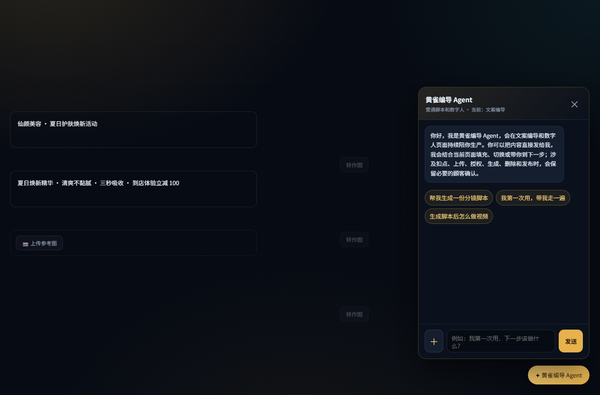
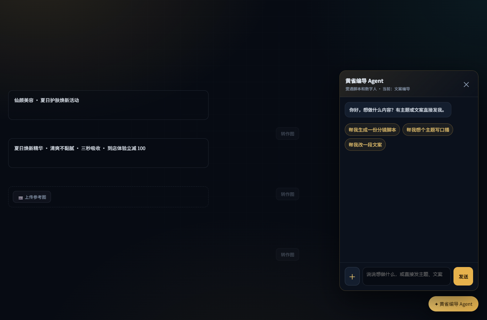
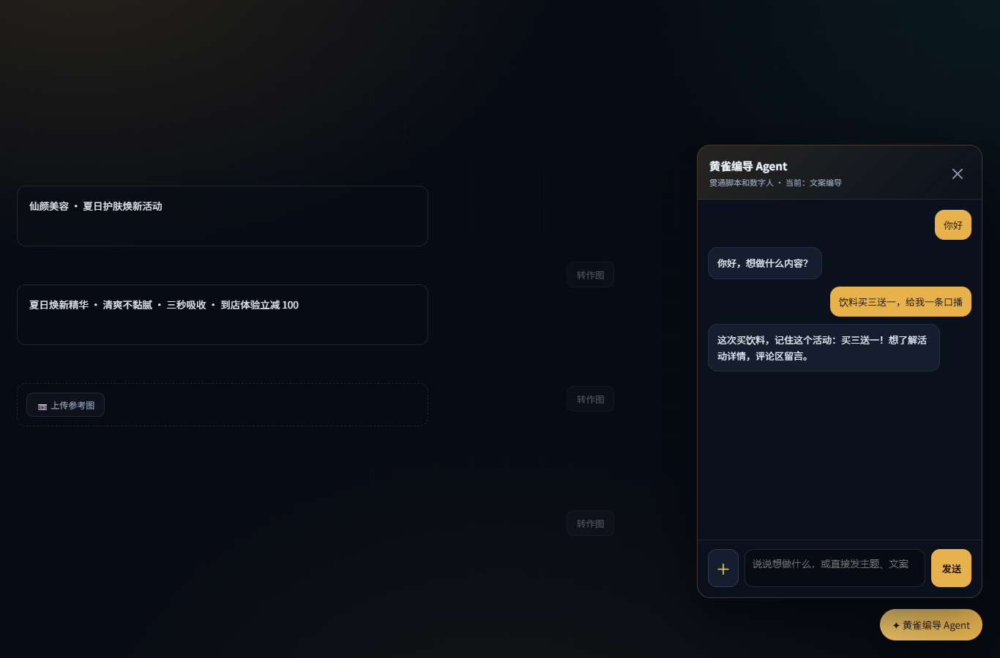
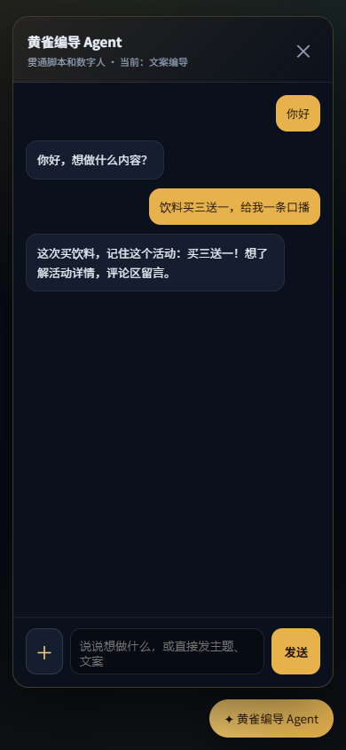

# 本地页面验收（2026-09-05）

运行 `node tests/director_conversation_browser.cjs`，使用 Playwright + 已安装 Edge headless。
需要本机可解析 `playwright` 包；可用 `NODE_PATH` 指向本机依赖目录。
临时 HTTP 绑定随机 127.0.0.1 端口，浏览器关闭后停止服务。

范围：真实 `script.html` DOM/CSS 和修改前后的 `script-agent.js`；
其他应用脚本禁用，登录/健康/聊天 job API 全部使用隔离本地替身，所有外站请求被拦截。
截图不是主站上线效果或真实模型生成证据，替身口播也不是 DeepSeek 实测回复。

通过项：

- 1366×900：修改前后开场对比，短开场显示、输入和发送正常。
- 问候、促销短稿展示在原聊天面板，普通写稿没有价格卡。
- 刷新后历史恢复，POST 数仍为 2，没有重复提交。
- 390×844：聊天面板完整在视口内，关闭正常。
- 开关关闭后不出现助手入口。
- 页面运行异常 0，外站请求 0。

证据：

| 修改前桌面 | 修改后桌面 |
| --- | --- |
|  |  |

注意：本轮不声明视频生产、图片/视频上传安全矩阵或真实账本端到端全通过。
原付款与幂等的自动化回归和 Base/Head 差异证据分别见 CI 与 PR 正文。
