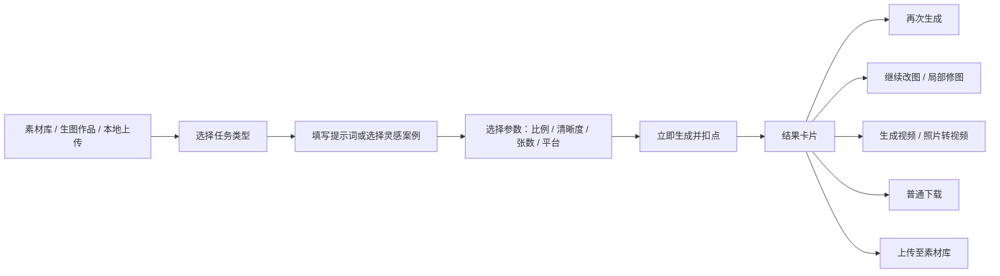
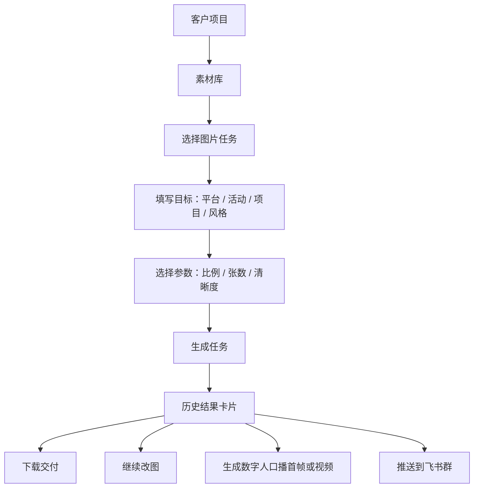

# 竞品深拆：Timarsky 星空作图页 `/banana/`

> 调研时间：2026-06-25  
> 调研页面：http://xk.iibot.com/banana/  
> 调研方式：登录态页面观察、OpenCLI 安装验证、浏览器 DOM/可见 UI 采集。未触发真实生成、未上传本地素材、未提交支付。  
> OpenCLI 状态：CLI 已安装，`agent-reach` 显示 OpenCLI 渠道可用；但 `opencli doctor` 显示 Browser Bridge 扩展未连接，所以本次对该网站的细节读取主要基于右侧 in-app browser 实测。

## 一句话结论

`/banana/` 不是一个普通的“AI 生图页”，而是一套图片生产工作台：它把图片创作、电商图、照片形象、局部修图、智能扩图、历史作品、教程、灵感模板和素材库串成了一个闭环。

它真正值得我们学习的不是某个模型名，而是这套流程：

**素材进入 → 选择任务类型 → 填 prompt/选模板 → 选择参数 → 扣点生成 → 结果卡片 → 再次生成/继续改图/生成视频/下载/入库。**

这正好对应我们未来的图片 bot 网页化：客户不应该只在飞书里丢一句话等回复，而应该能在网页里看到素材、任务、价格、失败、产出和下一步动作。

## 页面骨架

左侧是全站主导航：

| 一级入口 | 作用 |
|---|---|
| 灵感 | 案例广场和做同款入口 |
| 视频 | 视频/数字人/图生视频 |
| 作图 | 当前页，图片生产工作台 |
| 编导 | 文案、立项、拆解、分镜 |
| 音频 | 克隆、TTS、音乐、提取音频 |
| 画布 | 多素材、多模型串联 |
| 资产 | 素材库和作品库 |
| AI工具 | 工具集合 |
| 点数 | 余额与积分入口 |
| API | API 能力入口 |

作图页顶部是二级任务导航：

| 二级任务 | 当前观察到的成熟度 |
|---|---|
| 图片创作 | 已完整可用 |
| 电商主图/详情图 | 已完整可用，参数非常细 |
| 照片形象 | 已可用，适合人物形象和数字人前置素材 |
| 局部修图 | 已可用 |
| 智能扩图 | 已可用 |
| 海报设计 | 有入口，观察到“功能开发中，敬请期待” |
| LOGO创作 | 有入口，观察到“功能开发中，敬请期待” |
| 历史记录 | 贯穿所有任务 |
| 作图教程 | 嵌入视频教程 |

## 核心闭环

这个闭环非常重要。它让一次生成不是终点，而是下一次创作的起点。

对我们来说，图片 bot 网页化也必须有这个循环。否则客户只会把 bot 当一次性工具，而不是长期内容生产系统。

## 模块 1：图片创作

### 定位

通用 AI 生图入口，适合口播封面、人物写真、产品图、场景图、分镜图、创意图。

### 模型档位

| 模型档位 | 页面文案 | 价格/限制 |
|---|---|---|
| 大师版 | NanoPro | 4 点/张 |
| 全能版 | Nano2 | 4 点/张 |
| 免费版 | Image2 免费 | 按钮显示 8 点/张，同时显示“限时免费 15 张/天” |

这里有一个很细的产品设计：它同时展示了“模型真实价值”和“免费额度”。这比单纯写“免费”更利于后续收费，因为用户会知道免费额度本来对应成本。

### 输入

| 输入项 | 观察到的规则 |
|---|---|
| 参考图 | 可从“素材库”或“生图作品”选择 |
| 文件限制 | 图片不超过 10MB，尺寸不小于 300px |
| 文本框 | 3000 字上限 |
| placeholder | “简单描述你的图片创作。如：一个年轻化的女孩对着镜头微笑” |
| 辅助入口 | 分镜脚本撰写、灵感案例、清空 |

### 参数

| 参数 | 选项 |
|---|---|
| 比例 | 1:1、4:3、16:9、3:4、9:16 |
| 清晰度 | 普通1K、高清2K、超清4K |
| 张数 | 1张、2张、3张、5张、7张、9张 |
| 默认观察 | 9:16、普通1K、1张 |

默认 9:16 很关键。它明显服务于短视频封面、竖屏口播、手机端内容消费。

### 结果卡片动作

生成结果不是只给一个下载按钮，而是给一组后续动作：

| 动作 | 价值 |
|---|---|
| 再次生成 | 快速复用同一 prompt |
| 继续改图 | 进入连续迭代 |
| 局部修图 | 把成功图继续精修 |
| 生成视频 | 打通图生视频/数字人链路 |
| 普通下载 | 完成交付 |
| 上传至素材库 | 把结果变成下一次输入 |
| 更多 | 扩展动作入口 |

这套结果卡片是我们最应该直接借鉴的部分。

## 模块 2：电商主图/详情图

### 定位

这是作图页里商业化最明确的模块。它不是让用户“画一张图”，而是直接按电商平台交付格式生成主图、详情图、产品单图。

### 基础流程

| 环节 | 观察到的设计 |
|---|---|
| 模式 | 中文电商 / 跨境电商 |
| 素材 | 从素材库或生图作品选择，要求上传 1-6 张图片 |
| 文本 | 3000 字 prompt |
| 生成张数 | 默认 5 张，可选 5-15 张 |
| 价格 | 150 点/5 张 |

### 中文电商参数

| 参数 | 选项 |
|---|---|
| 图型 | 详情图、白底主图、产品单图 |
| 语言 | 中文简体、中文繁体 |
| 平台 | 淘宝、京东、拼多多、1688、小红书 |
| 比例 | 智能比例、1:1、3:2、2:3、3:4、4:3、4:5、5:4、9:16、16:9、21:9 |
| 张数 | 5张到15张 |

### 跨境电商参数

切到跨境电商后，默认变成：

| 参数 | 默认值 |
|---|---|
| 语言 | 英文 |
| 平台 | Amazon |
| 价格 | 150 点/5 张 |

跨境语言支持：

英文、俄语、日语、韩语、阿拉伯语、德语、西班牙语、法语、泰语、马来语、越南语、葡萄牙语、菲律宾语、印尼语、意大利语、荷兰语、波兰语、中文繁体。

跨境平台支持：

Amazon、Temu、Shopee、TikTok Shop、AliExpress、OZON。

### 对我们的启发

这个模块最像“把模型能力产品化”的样子。用户不需要知道底层模型，只需要选业务场景。

我们做美业获客时可以改成：

| 竞品电商参数 | 我们的美业版本 |
|---|---|
| 淘宝/京东/拼多多/1688/小红书 | 小红书/抖音/朋友圈/视频号/美团点评 |
| 白底主图/详情图/产品单图 | 团购套餐图/活动海报/客户案例图/门店环境图/项目介绍图 |
| 中文/跨境语言 | 普通话/粤语文案/英文可选 |
| 平台比例 | 小红书 3:4、抖音 9:16、朋友圈 1:1、详情页长图 |

我们不应该第一版就做泛电商，而应该做“美业门店内容图”。

## 模块 3：照片形象

### 定位

这是人物形象生成入口，很接近数字人业务的前置环节。它可以用于生成真人感形象、不同服装、不同场景、不同身份照，也可以生成后续口播视频需要的首帧。

### 输入与参数

| 项 | 观察到的规则 |
|---|---|
| 参考图 | 可从素材库或生图作品选择 |
| 参考数量 | 可添加多张参考图 |
| 文本框 | 3000 字上限 |
| placeholder | “简单描述你的创意想法” |
| 示例区 | 创意形象示例，可点击使用提示词 |
| 比例 | 默认 9:16 |
| 清晰度 | 默认普通1K |
| 张数 | 默认1张 |
| 价格 | 4 点/张 |

### 结果动作

照片形象的历史卡片里出现：

| 动作 | 含义 |
|---|---|
| 再次生成 | 继续产出同类形象 |
| 局部修图 | 精修人物细节 |
| 照片转视频 | 直接进入视频/数字人链路 |

### 对我们的启发

数字人业务不能只从“上传一张照片生成视频”开始。更好的链路是：

1. 先生成或整理客户形象照。
2. 再做局部修图和形象稳定。
3. 再把形象图送入数字人口播。
4. 最后沉淀到客户素材库。

也就是说，图片工作台是数字人工作台的上游。

## 模块 4：局部修图

### 定位

用于对一张已有图片做局部替换或局部修复。

### 流程

| 步骤 | 页面描述 |
|---|---|
| 上传/选择图片 | 素材库或生成作品 |
| 选择编辑区域 | 页面提示“编辑修改区域” |
| 描述替换内容 | 文本框 3000 字 |
| 生成 | 8 点/次 |

页面说明可以概括为：

**上传图片 + 编辑修改区域 + 描述替换内容 = 局部修图。**

### 对我们的启发

美业场景里，局部修图很重要：

| 客户诉求 | 对应功能 |
|---|---|
| 模特衣服不合适 | 换衣服 |
| 背景太乱 | 换背景/清理杂物 |
| 海报文字有错 | 局部替换 |
| 门店照片有瑕疵 | 修复局部 |
| 项目展示图不够干净 | 去杂物/强化对比 |

但第一版不一定要做复杂画笔工具。可以先让用户选图并描述“哪里要改”，由 AI 或人工运营补 mask。

## 模块 5：智能扩图

### 定位

把已有图片扩展到目标画幅，常用于短视频封面、海报、长图、平台适配。

### 流程

| 项 | 观察到的规则 |
|---|---|
| 输入 | 素材库或生成作品 |
| 格式 | 支持 JPG、PNG |
| 文件限制 | 图片不超过 10M |
| 文本 | 扩图要求选填，3000 字 |
| 操作 | 添加图片 + 选择扩图区域 + 描述扩图要求 |
| 价格 | 12 点/张 |

### 对我们的启发

智能扩图是一个低频但很刚需的“交付修补工具”。它不是获客主功能，但能显著提高交付质量。例如：

| 场景 | 价值 |
|---|---|
| 朋友圈图转抖音竖版 | 适配 9:16 |
| 小红书封面转详情页长图 | 扩展背景 |
| 数字人口播首帧不够宽 | 补出边缘 |
| 海报素材尺寸不够 | 扩边补图 |

## 模块 6：海报设计与 LOGO 创作

页面有“海报设计”和“LOGO创作”入口，但本次观察到：

- 切换到这两个 tab 后，页面仍保留智能扩图式输入区域。
- 页面出现“功能开发中，敬请期待”。

因此判断：这两个是预留能力，可能还没有完整上线，或者当前账号/环境未开放。

对我们的启发：可以先把入口摆出来，但不要把未成熟功能放到客户主链路。更好的方式是标为“内测中”或“找运营代做”。

## 辅助机制

### 灵感案例

“灵感案例”会弹出大量“做同款”模板，覆盖：

| 类型 | 观察到的例子 |
|---|---|
| 人物/形象 | 自拍视角、偷拍视角、居家口播、年轻企业家演讲 |
| 电商/商品 | 化妆品带货、商品展示、车载吸尘器、腕表商业海报 |
| 服饰 | 白背景换装、女士吊带、女士上衣 |
| 场景 | 卧室视角、户外日落、图书馆、飞机客舱、车窗视角 |
| 工厂/行业 | 电子厂、制鞋厂、服装厂、家具厂 |
| 创意 | 裸眼3D LED广告牌、时光旅行分屏、烟花文字 |

这说明竞品非常重视“不会写 prompt 的用户”。它没有只给空白文本框，而是提供做同款模板。

我们的美业版应该提供：

- 美容院周年庆活动图
- 皮肤管理小红书封面
- 医美项目科普图
- 门店顾客案例图
- 新客体验卡海报
- 老客复购提醒图
- 私域朋友圈成交图
- 数字人口播首帧图

### 分镜脚本撰写

点击“分镜脚本撰写”后出现弹窗：

| 元素 | 作用 |
|---|---|
| 输入框 | 输入分镜创意 |
| 脚本示例 | 给用户示范 |
| 立即生成 | 生成脚本 |
| 取消 | 关闭 |

这是一个很聪明的小桥：很多用户不会直接描述图片，但可以描述视频/故事，系统再帮他转成分镜图 prompt。

对我们来说，这个能力可以让“编导 bot”成为“图片 bot”的上游。比如客户说“我要做一个皮肤管理门店活动视频”，系统先拆脚本，再生成封面图/分镜图/口播首帧。

### 作图教程

作图教程以嵌入视频形式出现。对客户而言，这是降低学习成本；对平台而言，这是减少客服压力。

我们的第一版可以不做视频教程，但至少要做：

- 模板示例
- 一键填入
- 失败原因提示
- 推荐参数

### 历史记录

历史记录贯穿页面。每条结果卡片包含：

| 信息 | 价值 |
|---|---|
| 原始 prompt | 便于复用和复盘 |
| 功能类型 | 知道来自图片创作/照片形象等 |
| 模型/版本 | 便于成本和质量分析 |
| 比例/清晰度 | 可复用参数 |
| 创建时间 | 便于客户找图 |
| 状态 | 成功/失败 |
| 后续动作 | 再生成、改图、视频、下载、入库 |

这比飞书聊天记录更适合运营复盘。

## 积分口径汇总

| 功能 | 观察到的点数 |
|---|---:|
| 图片创作 NanoPro/Nano2 | 4 点/张 |
| 图片创作 Image2 | 显示 8 点/张，但限时免费 15 张/天 |
| 电商主图/详情图 | 150 点/5 张 |
| 照片形象 | 4 点/张 |
| 局部修图 | 8 点/次 |
| 智能扩图 | 12 点/张 |
| 海报设计 | 未确认，功能开发中 |
| LOGO创作 | 未确认，功能开发中 |

价格策略观察：

1. 高频通用生图便宜，4 点/张。
2. 电商图显著更贵，150 点/5 张，因为它包装了平台、语言、图型和批量交付。
3. 修图/扩图比普通生图贵，分别是 8 点/次、12 点/张。
4. 免费模型仍显示原价，有助于建立价值锚点。

## 它的产品设计强项

### 1. 它不是模型列表，而是任务列表

用户看到的是“电商主图、照片形象、局部修图、智能扩图”，不是一堆 API 名称。这让非技术用户更容易理解。

### 2. 它把结果做成了可继续流转的资产

每张图都可以继续改图、生成视频、上传素材库。这是闭环。

### 3. 它把平台参数前置

电商模块直接让用户选淘宝、京东、拼多多、1688、小红书、Amazon、Temu、Shopee、TikTok Shop 等平台。用户不用自己猜尺寸和文案风格。

### 4. 它保留历史记录

AI 产品最怕“生成完就丢”。它把历史记录做成操作台，让用户可以复用、迭代、下载和入库。

### 5. 它用模板解决 prompt 问题

“灵感案例”和“做同款”是降低门槛的核心。用户不是从空白开始。

### 6. 它用积分让成本显性化

每个按钮直接展示点数。这比隐藏成本更适合长期运营，也方便平台控制毛利。

## 它的问题和我们可以超越的地方

### 1. 功能多，但对新用户仍然偏复杂

作图页二级入口多、模型多、参数多。如果用户不是内容从业者，第一次进来可能不知道选哪个。

我们的机会：做“美业获客专用入口”，先问业务目标，而不是先问模型。

### 2. 海报/Logo 入口未成熟

竞品把未上线入口露出来了，容易造成预期落差。

我们的机会：第一版只放真的能交付的能力。内测能力放到运营后台或灰度入口。

### 3. 历史记录里失败结果很多

页面可见多条“生成失败”。失败本身不可怕，但如果客户看不懂原因，就会损害信任。

我们的机会：失败必须记录原因、是否退款、下一步建议。比如“图片太小”“人物脸部不清晰”“模型超时，已退点”。

### 4. 它缺少客户项目维度

它有素材库和历史记录，但看起来更偏个人创作工具。我们服务 B 端客户时，应该把“客户/门店/项目/活动”放在第一层。

我们的机会：比它更运营化，而不是更工具化。

## 对我们网页化图片 bot 的直接建议

### 第一版不要做“通用作图站”

应该做“美业获客内容图片工作台”。

推荐一级任务：

| 我们的任务 | 对标竞品能力 | 说明 |
|---|---|---|
| 小红书封面图 | 图片创作 + 平台参数 | 3:4 或 4:5，带标题感 |
| 抖音/视频号封面 | 图片创作 | 9:16，适合短视频 |
| 朋友圈成交图 | 图片创作/海报 | 1:1，强调信任与活动 |
| 团购套餐图 | 电商图 | 类似详情图/主图 |
| 门店活动海报 | 海报设计 | 可先做模板化 |
| 客户案例图 | 图片创作/局部修图 | 前后对比、案例包装 |
| 人设照片/数字人首帧 | 照片形象 | 数字人口播前置 |
| 局部修图 | 局部修图 | 修人物/背景/文字 |
| 扩图适配 | 智能扩图 | 适配不同平台 |

### P0 页面结构

### P0 控件

| 控件 | 默认建议 |
|---|---|
| 平台 | 小红书、抖音、视频号、朋友圈、美团点评 |
| 内容类型 | 封面图、活动图、套餐图、案例图、门店图、首帧图 |
| 比例 | 小红书 3:4、抖音 9:16、朋友圈 1:1 |
| 张数 | 1、2、3、5 |
| 清晰度 | 普通/高清 |
| 素材来源 | 上传、素材库、历史作品 |
| 文案来源 | 手写、文案 bot、抖音抓取结果 |

### 结果卡片必须有的动作

| 动作 | 原因 |
|---|---|
| 再生成 | 客户经常要多看几个版本 |
| 继续改图 | 真实交付一定要改 |
| 局部修图 | 修脸、修背景、修文字 |
| 生成视频 | 连接数字人/短视频链路 |
| 下载 | 交付 |
| 入库 | 变成客户资产 |
| 推送飞书 | 回到客户群，让客户感知服务 |

### 成本与点数

我们可以学习它的“点数显性化”，但内部必须做两套账：

| 账本 | 用途 |
|---|---|
| 客户点数 | 用户看到的消费口径 |
| 内部成本 | 真实模型/API/服务器成本 |
| 毛利统计 | 判断某客户是否亏钱 |
| 失败退款 | 保证体验 |

对于当前业务，图片生成成本已经是大头，因此网页工作台必须把图片任务纳入成本看板。

## 和飞书 bot 的关系

网页不是替代飞书，而是给飞书 bot 一个可视化操作面。

推荐交互：

1. 客户在飞书群里 @ 图片 bot：我要做一个小红书封面。
2. bot 回复一个任务卡片和网页链接。
3. 客户或运营在网页里补素材、选参数、点生成。
4. 生成完成后，网页保存结果，bot 自动把成品发回飞书群。
5. 看板记录本次任务的客户、agent、成本、耗时、失败原因。

这样飞书是客户现场，网页是生产后台。

## 和 Seedance 素材库的关系

本地 `Seedance真人视频-美业活动` 文件夹可以直接映射成网页资产库：

| 本地目录 | 网页模块 |
|---|---|
| `01-输入素材` | 上传素材 / 客户素材 |
| `02-生成产出` | 历史结果 |
| `03-成品交付` | 交付作品 |
| `00-项目说明与文案` | 文案来源 / 项目上下文 |
| `90-AI脚本与代码` | 后台任务脚本 |
| `91-运行记录与调试` | 任务日志 / 失败复盘 |

这能把“人看得懂的素材库”和“AI 可调用的任务系统”连接起来。

## 第一版落地范围

### P0：必须做

- 客户项目列表
- 素材上传/选择
- 小红书封面、抖音封面、朋友圈图、团购套餐图
- prompt + 平台参数 + 比例 + 张数
- 生成任务和历史卡片
- 下载、入库、推送飞书
- 成本/点数记录
- 失败状态与退款/重试标记

### P1：随后做

- 文案 bot 结果直接作为图片 prompt
- 抖音抓取结果直接变成封面/海报 prompt
- 局部修图
- 智能扩图
- 数字人口播首帧生成
- 模板库/做同款

### P2：晚点做

- Logo 创作
- 泛海报设计
- 多模型商城
- 通用画布
- 复杂图片编辑器

## 最大启发

`/banana/` 的本质不是“生图”，而是“图片资产生产线”。

我们要对标的不是它有多少模型，而是它这几个产品动作：

1. 把能力包装成业务任务。
2. 把结果变成可复用资产。
3. 把每次生成变成可继续迭代的节点。
4. 把积分/成本前置。
5. 用灵感案例和模板解决用户不会下 prompt 的问题。
6. 把图片链路接到视频和数字人链路。

如果我们把这套逻辑放进美业获客业务里，就会形成自己的闭环：

**短视频抓取 → 文案生成 → 图片/封面生成 → 数字人口播 → 飞书交付 → 数据看板复盘 → 下一轮模板优化。**
